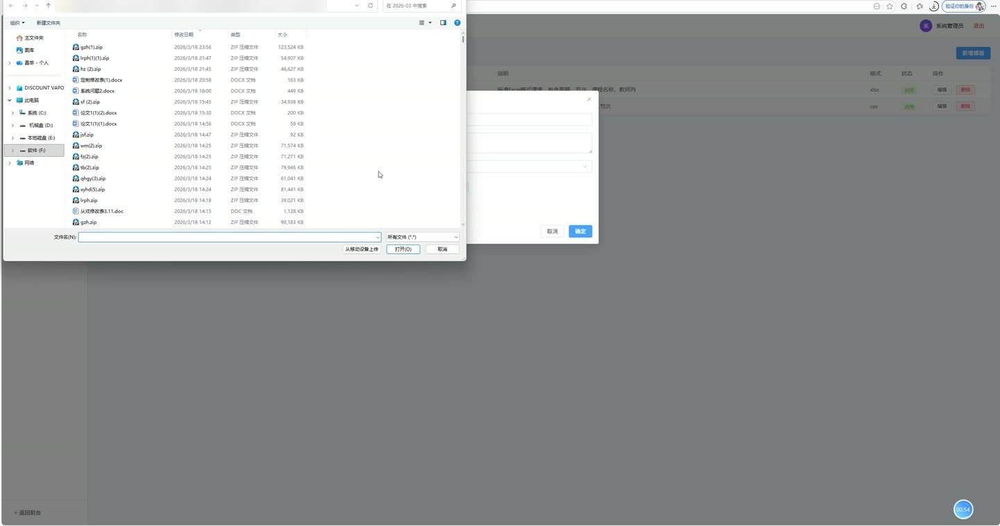
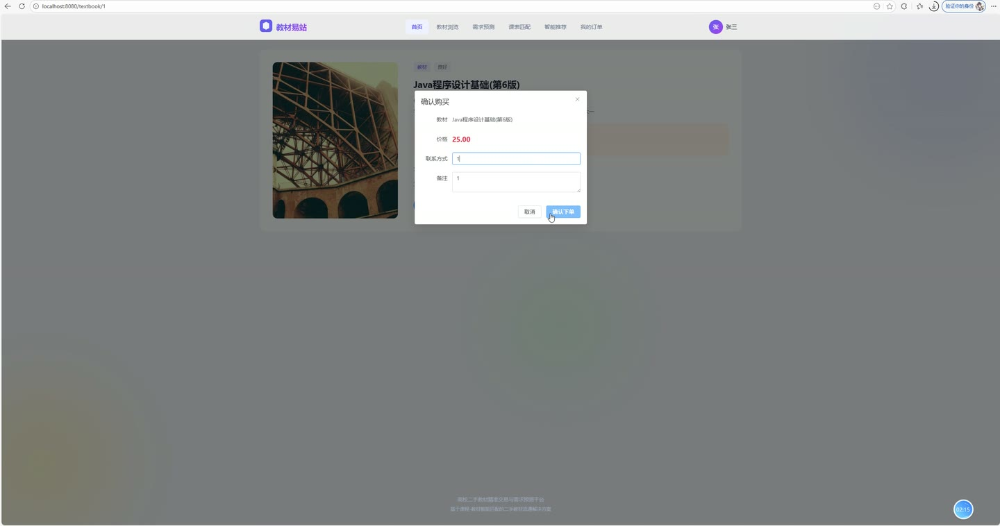
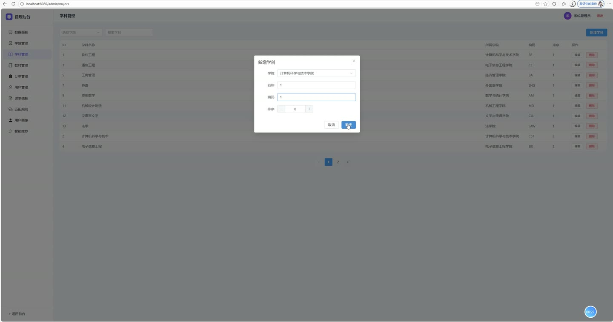
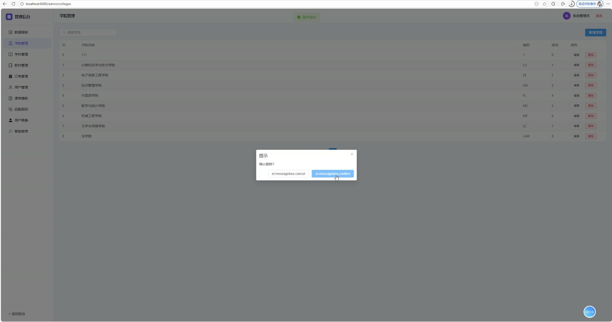

# (附文档)Springboot3+Vue3+MySQL 基于课程-教材智能匹配的高校二手教材精准交易与需求预测平台

**技术栈**：Springboot3、Vue3、MySQL

### 系统简介

本系统是一个面向高校的二手教材交易与需求预测平台，采用前后端分离架构（Spring Boot 3 + Vue 3）。平台包含学生用户端和管理员端两大角色，核心特色在于基于课程-教材智能匹配算法，实现课表自动匹配教材、个性化推荐、用户画像分析以及教材需求预测，帮助高校学生精准买卖二手教材。
 
### 核心功能
 
### 普通用户端

 
- 注册与登录：通过用户名/密码注册学生账号，登录后获取JWT令牌用于后续请求鉴权。 
- 个人信息管理：查看/修改个人资料（昵称、头像、手机、邮箱、所属学院/专业、年级）。 
- 浏览教材列表：按标题、课程名称、学院、专业、分类（教材/教辅/习题集/笔记）等条件筛选查看在售教材。 
- 教材详情查看：查看教材封面、作者、出版社、ISBN、原价/售价、成色、描述、课程名称及发布者信息。 
- 收藏/取消收藏教材：点击收藏按钮切换收藏状态，收藏后教材的收藏计数自动更新。 
- 查看我的收藏：列表展示当前用户所有收藏的教材。 
- 发布教材：填写标题、作者、出版社、ISBN、价格、成色、所属学院/专业、课程名称、分类等信息发布二手教材（状态为待审核）。 
- 管理我的发布：查看自己发布的教材列表，支持编辑信息或下架删除。 
- 上传课表（Excel）：上传包含课程名称、教师、星期、节次等信息的Excel文件，系统自动解析并存储课程数据。 
- 课程-教材智能匹配：基于上传课表中的课程名称，结合管理员配置的匹配规则（课程关键词→教材关键词），自动匹配出在售教材并显示匹配原因。 
- 下单购买教材：选择在售教材创建订单，系统自动生成订单号、记录买卖双方、价格及联系方式。 
- 查看我的订单：按“我买到的”/“我卖出的”分类查看订单列表，支持按订单号或状态筛选。 
- 订单状态流转：卖家确认订单（待确认→已确认）、买家完成交易（已确认→已完成，自动将教材标记为已售）、双方均可取消订单。 
- 个性化推荐：系统根据用户的专业、收藏、浏览记录、购买历史等生成推荐教材列表，并显示推荐理由（如“与您的专业匹配”、“本学院热门教材”）。 
- 需求预测查看：按学院、教材分类筛选查看系统预测的教材需求热度和预测交易量，支持查看预测周期（如2025-春）。 
- 首页轮播图：查看管理员发布的活动或公告轮播图。
 
### 管理员端

 
- 仪表盘统计：查看平台总用户数、教材数、订单数、已完成订单数；按学院统计教材数量；按分类统计教材分布；按状态统计订单分布。 
- 学院管理：新增、编辑、删除学院（含名称、编码、排序），支持按名称模糊搜索。 
- 专业管理：新增、编辑、删除专业（关联学院），支持按学院筛选和按名称搜索。 
- 教材管理：查看所有教材列表（按标题/状态筛选），审核教材（通过/驳回/下架），删除违规教材。 
- 订单管理：查看所有订单（按订单号/状态筛选），手动修改订单状态（如强制完成/取消）。 
- 用户管理：查看所有用户列表（按用户名/昵称搜索），启用或禁用用户账号。 
- 课表模板管理：上传和管理课表Excel模板，供学生下载参考。 
- 匹配规则管理：新增/编辑/删除课程-教材匹配规则（设置课程关键词和对应的教材关键词），支持按关键词搜索。 
- 用户画像管理：查看所有学生的用户画像（含标签、专业偏好、兴趣标签、浏览历史摘要），支持为单个用户或全部用户重建画像（基于订单、收藏、浏览记录计算）。 
- 推荐管理：查看系统为各用户生成的推荐教材列表（含评分和理由），支持为单个用户或全部用户重新生成推荐。 
- 需求预测管理：查看所有需求预测数据（按热度排序），系统每月1日凌晨自动基于历史订单数据、季节性因子和增长趋势重新生成预测。
 
### 技术栈

 后端框架Spring Boot 3 ORMMyBatis-Plus（含分页插件、逻辑删除） 权限认证JWT（自定义拦截器） 前端框架Vue 3（Composition API + script setup） 状态管理Pinia 前端路由Vue Router 4（含导航守卫鉴权） UI 组件库Element Plus 构建工具Vite 数据库MySQL（含逻辑删除字段） 定时任务Spring @Scheduled（每月1号自动生成预测） 文件处理Apache POI（Excel课表解析）、文件上传
 
### 交付内容

 
- 后端完整源码 
- 前端完整源码 
- 数据库初始化脚本 
- 万字文档

## 界面展示

---

## 获取完整源码 + 万字文档

本仓库为项目介绍页。**完整前后端源码、数据库初始化脚本、万字项目文档**，请加微信 `kangkangcode`，或访问 [codekk.top](http://codekk.top) 获取。

可作课程设计 / 毕业设计参考，支持远程部署调试。